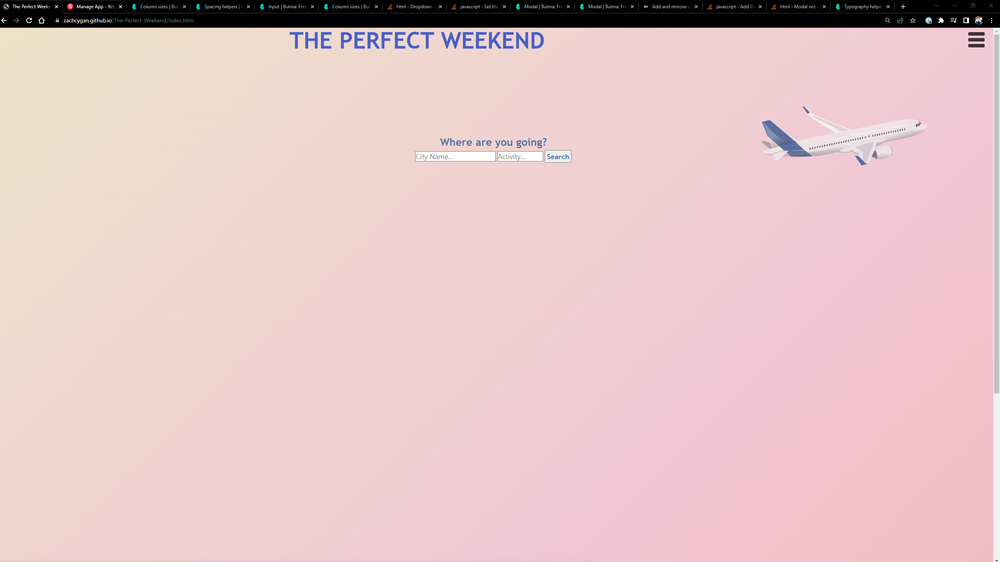
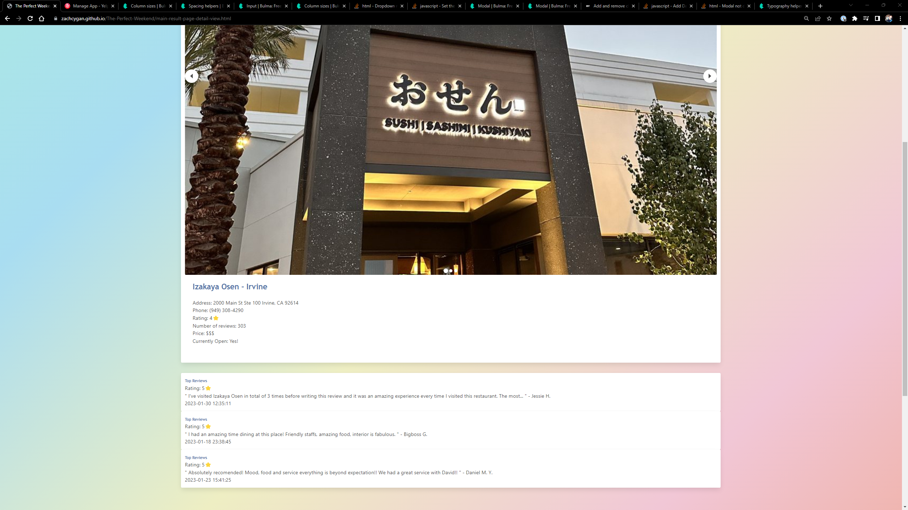
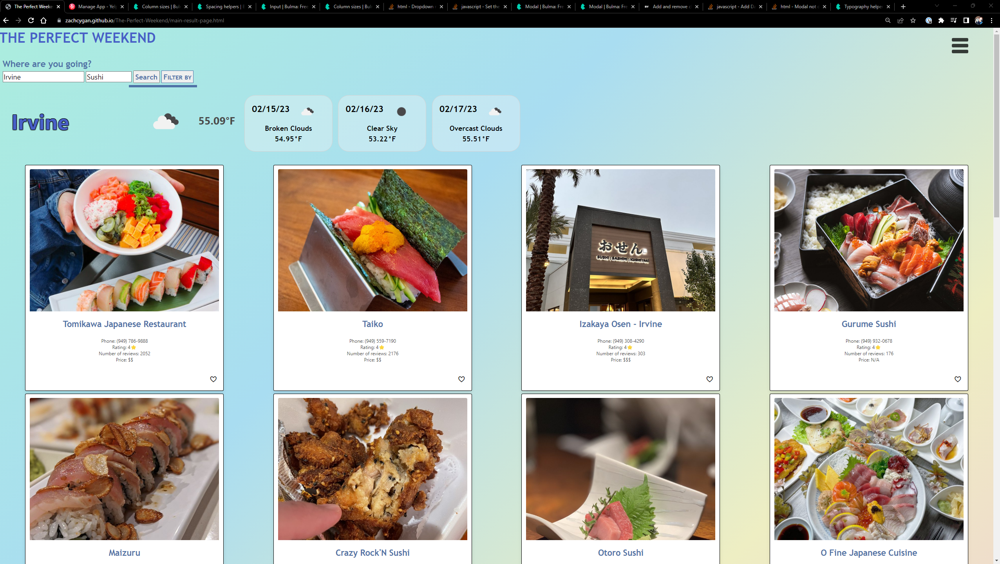
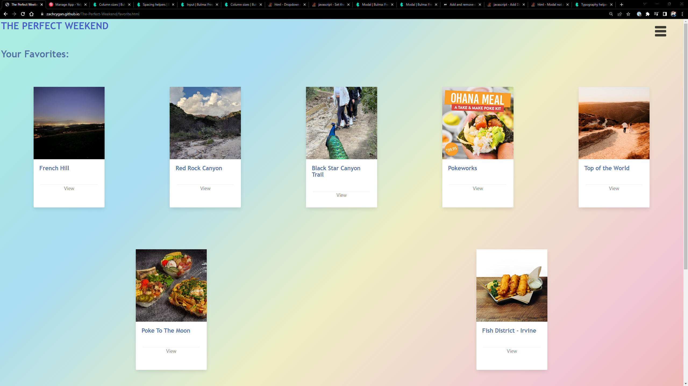

# <The-Perfect-Weekend>

## Description

Our motivation for this project is to make a website that gives users the ability to find restaurants, activities and points of interests in a desired location to help plan the perfect getaway. The Perfect Weekend uses the Yelp API to  get up-to-date reviews and ratings from businesses in any location searched. Users may save actvities they find interesting and refer back to them later using the favorites page. 

## Installation

The webpage is available at https://zachcygan.github.io/The-Perfect-Weekend/index.html. To view the source code within your browser, press F12 or right click the webpage and select "inspect" on windows. For MacOS,  press Command+Option+I or fn F12 (MacOS) to open Chrome DevTools. You can view any elements on the webpage or any of the styling by selecting the corresponding section in Chrome DevTools. 

## Technologies/Languages Used
    - HTML
    - CSS
    - JavaScript
    - JQuery
    - BULMA
    - Google Fonts
    - Yelp Fusion API
    - Open Weather API

## Instructions

To begin searching for activities enter a city and an activity, then click the search button. 20 results will be displayed per search, but more may be loaded when the user scrolls to the bottom of the page, if there are more results. Any activity or point of interest may be saved and viewed at any time on the favorites page. Activities that are favorited will have a red heart on the bottom right of the search results. To remove the activity from your favorites, simply click the heart icon and it will be removed. Additionally, the searched cities current weather and 3 day forecast will be displayed at the top of the screen. The forecast cards are hidden on smaller devices. Users may filter their search results by best match, prices, ratings, and reviews. Each time more results are loaded, they will be sorted in their fetch call respectively. This means that the page will not resort previously loaded results. 

## Screenshots

